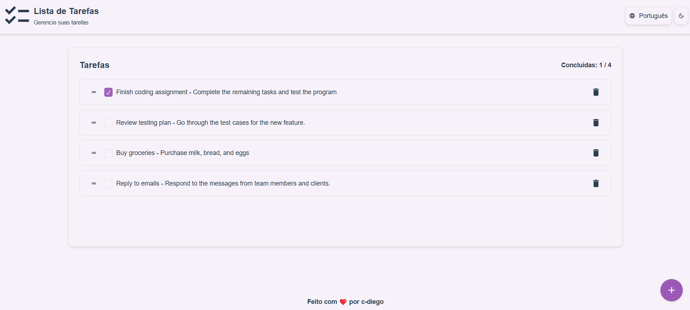
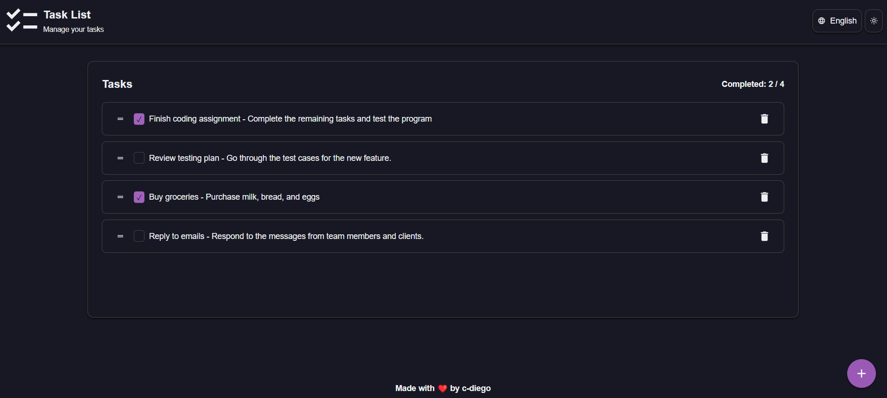

# TODO List Project

This project is a simple TODO list application built using React, TypeScript, and Vite. It allows users to add, delete, and mark tasks as completed. The project is designed to be a starting point for learning and building more complex applications with these technologies.





## Features

- Add new tasks
- Delete tasks
- Mark tasks as completed
- Responsive design
- Support for multiple languages (Portuguese, English, Spanish)
- Toggle between light and dark themes
- Reorder tasks with drag-and-drop functionality

## Installation

To get started with this project, follow the steps below:

1. Clone the repository:

```bash
   git clone https://github.com/c-diego/todo-list.git
```

2. Navigate to the project directory:

```bash
   cd todo-list
```

3. Install the dependencies:

```bash
  yarn
```

4. To run the application locally, use the following command:

```bash
  yarn dev
```

## Project Structure (simplified)

```
📦src
 ┣ 📂components
 ┃ ┣ 📜Footer.tsx
 ┃ ┣ 📜Header.tsx
 ┃ ┣ 📜TaskDashboard.tsx
 ┃ ┗ 📜Dialog.tsx
 ┣ 📂context
 ┃ ┗ 📜ThemeContext.tsx
 ┣ 📂hooks
 ┃ ┣ 📜useTaskService.ts
 ┃ ┗ 📜useToggle.ts
 ┣ 📂styles
 ┃ ┗ 📜GlobalStyles.tsx
 ┣ 📂view
 ┃ ┗ 📜pages
 ┃   ┗ 📜TasksPage.tsx
 ┣ 📜App.tsx
 ┣ 📜main.tsx
 ┗ 📜vite-env.d.ts
```

## Language Support

The project supports the following languages:

- Portuguese
- English
- Spanish

The language is automatically detected based on the browser's settings but can be manually changed in the header.

## Themes

The project supports light and dark themes. The theme is automatically toggled based on the system's preference or can be manually adjusted.

## Future Improvements

- Add confirmation when **deleting** tasks.
- Persist tasks.
- Implement authentication.
- Add new boards, such as "To Do," "In Progress," and "Done."
- Add a **timer** for tasks.
- Add support for notifications as task reminders.
- Add support for file attachments in tasks.
- Create productivity reports based on completed tasks.
- Improve accessibility for users with special needs.

## License

This project is licensed under the MIT License. See the LICENSE file for more details.
