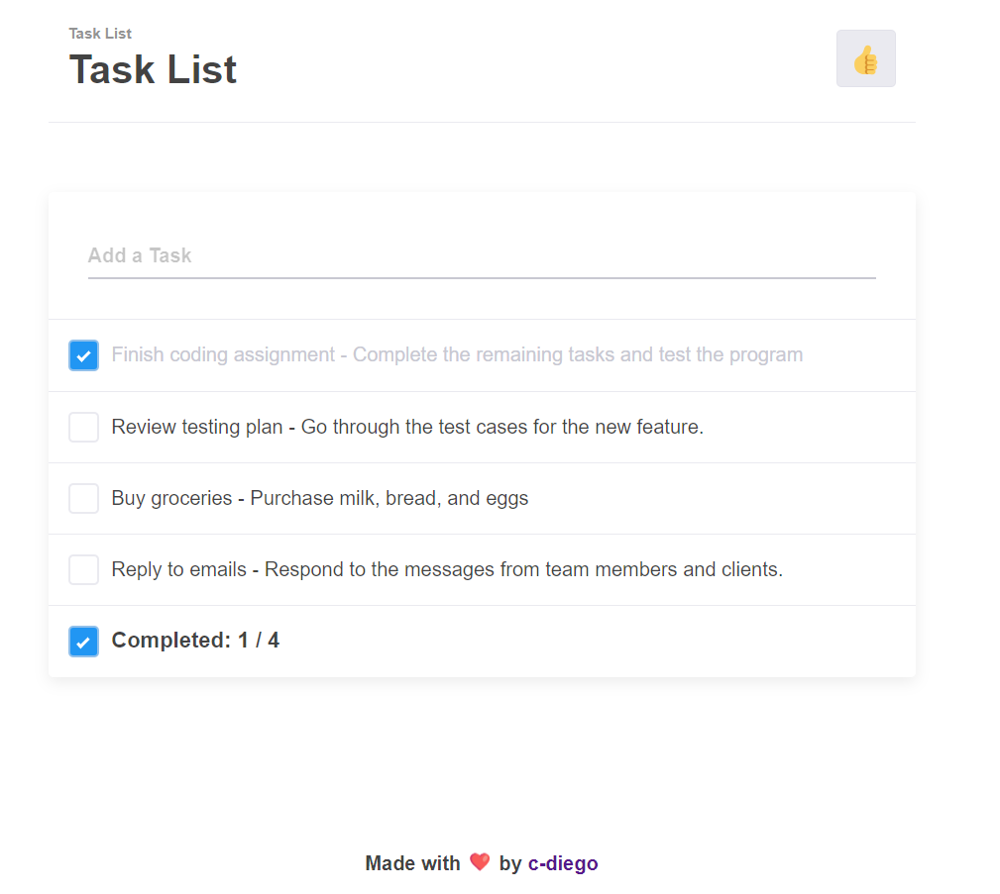

# TODO List Project

Este projeto é uma aplicação simples de lista de TODOs construída usando React, TypeScript e Vite. Ele permite que os usuários adicionem, excluam e marquem tarefas como concluídas. O projeto é projetado para ser um ponto de partida para aprender e construir aplicações mais complexas com essas tecnologias.



## Funcionalidades

- Adicionar novas tarefas
- Excluir tarefas
- Marcar tarefas como concluídas
- Design responsivo

## Instalação

Para começar com este projeto, siga os passos abaixo:

1. Clone o repositório:
```bash
   git clone https://github.com/c-diego/todo-list.git
```
2. Navegue até o diretório do projeto:
```bash
   cd todo-list
```

3. Instale as dependências: 
```bash
  yarn
```

4. Para executar a aplicação localmente, use o seguinte comando:
```bash
yarn dev
```
## Estrutura do projeto (simplificada)
```
📦src
 ┣ 📂components
 ┃ ┣ 📜Footer.tsx
 ┃ ┣ 📜Main.tsx
 ┃ ┗ 📜Title.tsx
 ┣ 📜App.css
 ┣ 📜App.tsx
 ┣ 📜index.css
 ┣ 📜main.tsx
 ┗ 📜vite-env.d.ts
 ```

## Licença
Este projeto é licenciado sob a Licença MIT. Veja o arquivo LICENSE para mais detalhes.